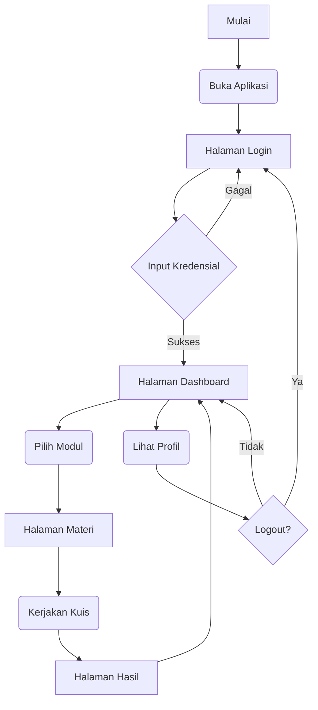

# MAKALAH PROYEK APLIKASI E-LEARNING "FUNDAMENTALS CODE"

---

**Diajukan untuk Memenuhi Tugas Ujian Akhir Semester (UAS) Mata Kuliah Sistem Media Interaktif**

 
 
 

**Disusun oleh:**

**[Nama Anda]**

**[NIM Anda]**

 
 
 

**PROGRAM STUDI INFORMATIKA**

**FAKULTAS ILMU KOMPUTER**

**INSTITUT TEKNOLOGI TANGERANG SELATAN**

**TAHUN 2026**

---

## KATA PENGANTAR

Puji syukur kehadirat Tuhan Yang Maha Esa atas rahmat dan karunia-Nya sehingga penulis dapat menyelesaikan makalah proyek yang berjudul **"Pengembangan Aplikasi E-Learning 'Fundamentals Code' Berbasis Web"** ini dengan baik dan tepat waktu. Makalah ini disusun untuk memenuhi tugas Ujian Akhir Semester (UAS) mata kuliah Sistem Media Interaktif.

Dalam penyusunan makalah ini, penulis menyadari bahwa masih terdapat banyak kekurangan. Oleh karena itu, penulis mengharapkan kritik dan saran yang membangun dari semua pihak demi kesempurnaan makalah ini. Semoga makalah ini dapat memberikan manfaat dan pengetahuan bagi para pembaca.

 
 

Tangerang Selatan, 30 Januari 2026

Penulis

---

## DAFTAR ISI

- **KATA PENGANTAR**
- **DAFTAR ISI**
- **BAB I: PENDAHULUAN**
  - 1.1 Latar Belakang
  - 1.2 Rumusan Masalah
  - 1.3 Tujuan dan Manfaat
- **BAB II: LANDASAN TEORI**
  - 2.1 Sistem Media Interaktif
  - 2.2 React.js
  - 2.3 Vite.js
  - 2.4 GitHub Pages
  - 2.5 Mermaid.js
- **BAB III: PERANCANGAN DAN IMPLEMENTASI**
  - 3.1 Perancangan Sistem
    - 3.1.1 Flowchart
    - 3.1.2 Storyboard
  - 3.2 Implementasi Sistem
    - 3.2.1 Teknologi yang Digunakan
    - 3.2.2 Struktur Proyek
- **BAB IV: PENGUJIAN DAN HASIL**
  - 4.1 Metode Pengujian
  - 4.2 Skenario Pengujian
  - 4.3 Hasil Aplikasi (Screenshots)
- **BAB V: PENUTUP**
  - 5.1 Kesimpulan
  - 5.2 Saran
- **DAFTAR PUSTAKA**

---

## BAB I: PENDAHULUAN

### 1.1 Latar Belakang

Seiring dengan pesatnya perkembangan teknologi digital, penguasaan logika dan konsep dasar pemrograman menjadi kompetensi kunci yang sangat dibutuhkan di dunia industri. Siswa Sekolah Menengah Kejuruan (SMK), khususnya pada jurusan seperti Rekayasa Perangkat Lunak (RPL) atau Teknik Komputer dan Jaringan (TKJ), dituntut untuk memiliki pemahaman yang kuat sejak dini. Namun, metode pembelajaran konvensional yang cenderung monoton dan teoritis seringkali membuat siswa kesulitan memahami konsep pemrograman yang abstrak dan merasa kurang termotivasi. Untuk mengatasi tantangan tersebut, diperlukan sebuah media pembelajaran yang inovatif, interaktif, dan mampu memvisualisasikan konsep-konsep sulit menjadi lebih mudah dicerna.

Aplikasi "Fundamentals Code" ini dikembangkan sebagai solusi untuk tantangan tersebut, dengan menyediakan platform pembelajaran berbasis web yang fokus pada konsep fundamental pemrograman yang dapat diaplikasikan pada berbagai bahasa.

### 1.2 Rumusan Masalah

Berdasarkan latar belakang di atas, rumusan masalah dari proyek ini adalah sebagai berikut:
1.  Bagaimana merancang dan membangun sebuah media pembelajaran interaktif untuk konsep dasar pemrograman yang menarik dan mudah digunakan bagi siswa SMK?
2.  Bagaimana mengimplementasikan fitur manajemen konten yang memungkinkan guru untuk menambah, mengubah, dan mengelola materi serta kuis secara dinamis?
3.  Bagaimana menyajikan materi yang terstruktur dalam format Bab dan Sub-Bab untuk meningkatkan pengalaman belajar siswa?

### 1.3 Tujuan dan Manfaat

**Tujuan:**
Tujuan utama dari proyek ini adalah merancang dan membangun sebuah aplikasi e-learning interaktif bernama "Fundamentals Code" yang efektif untuk mengajarkan konsep-konsep fundamental pemrograman kepada siswa SMK, serta menyediakan panel admin bagi guru untuk mengelola konten.

**Manfaat:**
1.  **Bagi Siswa:** Meningkatkan pemahaman dan motivasi belajar pemrograman melalui pendekatan visual, praktik langsung, dan alur belajar yang terstruktur.
2.  **Bagi Guru:** Menyediakan alat bantu ajar yang modern dan dinamis, di mana guru dapat menyesuaikan materi dan kuis sesuai dengan kebutuhan kurikulum.

---

## BAB II: LANDASAN TEORI

### 2.1 Sistem Media Interaktif

Sistem Media Interaktif adalah sistem yang memungkinkan pengguna untuk berinteraksi dengan konten digital secara aktif, tidak hanya pasif menerima informasi. Pengguna dapat memberikan input untuk mengontrol lingkungan dan mendapatkan umpan balik dari sistem. Dalam konteks e-learning, interaktivitas dapat meningkatkan keterlibatan dan retensi pengetahuan siswa.

### 2.2 React.js

React.js adalah sebuah library JavaScript yang dikembangkan oleh Facebook untuk membangun antarmuka pengguna (UI) yang interaktif. React bekerja dengan konsep komponen, di mana setiap bagian dari UI (tombol, form, kartu) adalah komponen independen yang dapat digunakan kembali. Ini membuat pengembangan aplikasi web kompleks menjadi lebih terstruktur dan efisien.

### 2.3 Vite.js

Vite.js adalah sebuah *build tool* modern untuk pengembangan web yang memberikan pengalaman pengembangan yang sangat cepat. Vite menggunakan *native ES modules* di browser untuk menyediakan *hot module replacement* (HMR) instan, yang berarti perubahan pada kode dapat langsung terlihat di browser tanpa perlu me-refresh halaman.

### 2.4 GitHub Pages

GitHub Pages adalah layanan hosting situs web statis yang disediakan oleh GitHub. Layanan ini mengambil file HTML, CSS, dan JavaScript langsung dari sebuah repository di GitHub dan menayangkannya sebagai sebuah situs web. Ini adalah cara yang gratis dan mudah untuk mendeploy proyek-proyek portofolio atau aplikasi web statis.

### 2.5 Mermaid.js

Mermaid.js adalah sebuah library JavaScript yang dapat me-render diagram dan flowchart dari teks dengan sintaks yang mirip Markdown. Ini memungkinkan pengembang untuk membuat dan memodifikasi diagram kompleks dengan cepat tanpa perlu menggunakan software desain grafis.

---

## BAB III: PERANCANGAN DAN IMPLEMENTASI

### 3.1 Perancangan Sistem

#### 3.1.1 Flowchart

Diagram alir berikut menggambarkan alur logika dan navigasi utama dalam aplikasi "Fundamentals Code".

#### 3.1.2 Storyboard

- **Layar Siswa:**
    1.  **Halaman Login:** Form untuk masuk ke aplikasi. Menjadi halaman utama.
    2.  **Halaman Dashboard:** Menampilkan daftar semua modul pembelajaran.
    3.  **Halaman Detail Materi:** Tampilan dengan navigasi Bab/Sub-Bab di kiri dan konten di kanan.
    4.  **Halaman Kuis:** Menampilkan pertanyaan dan pilihan jawaban.
    5.  **Halaman Hasil Kuis:** Menampilkan skor dan rekapitulasi.
    6.  **Halaman Profil:** Menampilkan data pengguna dan tombol logout.
- **Layar Guru (Admin):**
    1.  **Halaman Panel Admin:** Menampilkan daftar modul dengan opsi "Edit" dan "+ Tambah Modul Baru".
    2.  **Halaman Editor Modul:** Form untuk membuat/mengedit judul, deskripsi, bab, sub-bab, dan kuis.

### 3.2 Implementasi Sistem

#### 3.2.1 Teknologi yang Digunakan

- **Frontend Library:** React.js
- **Build Tool:** Vite.js
- **Routing:** React Router DOM v6 (menggunakan `HashRouter` untuk kompatibilitas GitHub Pages)
- **State Management:** React Context API (untuk status otentikasi dan manajemen data modul)
- **Diagram Rendering:** Mermaid.js
- **Deployment:** GitHub Pages

#### 3.2.2 Struktur Proyek

Proyek ini disusun dengan struktur folder sebagai berikut untuk menjaga keterbacaan dan skalabilitas kode:

- **/src/components:** Berisi komponen React yang dapat digunakan kembali, seperti `ProtectedRoute` dan `PublicLayout`.
- **/src/context:** Berisi file-file untuk state management global menggunakan React Context, seperti `AuthContext` dan `ModuleContext`.
- **/src/data:** Berisi data awal (mock data) untuk modul pembelajaran.
- **/src/pages:** Berisi komponen-komponen yang merepresentasikan satu halaman penuh, seperti `Login.jsx`, `Dashboard.jsx`, dan `AdminDashboard.jsx`.
- **/dist:** Folder hasil *build* produksi yang di-generate oleh Vite, yang berisi file statis untuk di-deploy.

---

## BAB IV: PENGUJIAN DAN HASIL

### 4.1 Metode Pengujian

Pengujian aplikasi dilakukan menggunakan metode **Blackbox Testing**. Metode ini berfokus pada pengujian fungsionalitas aplikasi dari perspektif pengguna akhir, tanpa melihat atau menganalisis kode sumber internal. Pengujian dilakukan dengan memberikan input pada antarmuka pengguna dan memverifikasi bahwa output atau hasil yang diberikan sesuai dengan yang diharapkan.

### 4.2 Skenario Pengujian

| ID Kasus | Fitur yang Diuji | Skenario Pengujian | Hasil yang Diharapkan |
| :--- | :--- | :--- | :--- |
| **TC-001** | Login Siswa | Masuk dengan kredensial valid. | Pengguna berhasil login dan diarahkan ke Dashboard. |
| **TC-002** | Rute Terlindungi | Mencoba akses `/dashboard` tanpa login. | Pengguna dialihkan kembali ke halaman `/login`. |
| **TC-003** | Akses Admin | Mengakses rute `/#/admin` di browser. | Halaman Panel Admin Guru berhasil ditampilkan. |
| **TC-004** | Navigasi Materi | Siswa memilih Bab & Sub-Bab di halaman materi. | Konten materi yang sesuai berhasil ditampilkan. |
| **TC-005** | Fungsionalitas Kuis | Siswa mengerjakan kuis dan menyelesaikan. | Halaman hasil menampilkan skor yang benar. |
| **TC-006** | Pembuatan Materi | Guru membuat modul baru melalui panel admin. | Modul baru muncul di halaman Dashboard siswa. |
| **TC-007** | Logout | Menekan tombol Logout di halaman Profil. | Pengguna berhasil keluar dan diarahkan ke halaman Login. |

### 4.3 Hasil Aplikasi (Screenshots)

**(Bagian ini perlu Anda isi dengan tangkapan layar dari aplikasi yang berjalan)**

- *[Screenshot Halaman Login]*
- *[Screenshot Halaman Dashboard]*
- *[Screenshot Halaman Detail Materi (dengan navigasi Bab/Sub-Bab)]*
- *[Screenshot Halaman Kuis]*
- *[Screenshot Halaman Hasil Kuis]*
- *[Screenshot Halaman Panel Admin Guru (`.../#/admin`)]*
- *[Screenshot Halaman Editor Modul (`.../#/admin/create`)]*

---

## BAB V: PENUTUP

### 5.1 Kesimpulan

Proyek ini telah berhasil merancang dan mengimplementasikan prototipe aplikasi e-learning "Fundamentals Code" berbasis web menggunakan React. Aplikasi ini menyediakan media pembelajaran konsep pemrograman yang interaktif untuk siswa, dengan materi yang terstruktur dalam format Bab dan Sub-Bab. Selain itu, aplikasi ini juga dilengkapi dengan panel admin fungsional yang memungkinkan guru untuk mengelola konten pembelajaran secara dinamis. Pengujian fungsionalitas inti menunjukkan bahwa aplikasi berjalan sesuai dengan perancangan.

### 5.2 Saran

Untuk pengembangan di masa depan, beberapa perbaikan dan penambahan fitur dapat dilakukan, antara lain:
1.  **Otentikasi Penuh:** Mengimplementasikan sistem otentikasi yang terhubung ke database backend sungguhan, termasuk pemisahan peran antara siswa dan guru.
2.  **Penyimpanan Data:** Mengganti state management lokal dengan database (misalnya, Firebase, Supabase, atau database SQL/NoSQL lainnya) agar data bersifat persisten.
3.  **Variasi Konten:** Menambahkan dukungan untuk tipe konten selain teks, seperti video, animasi, dan latihan *coding* interaktif dengan *live feedback*.
4.  **Gamifikasi:** Menambahkan lebih banyak elemen gamifikasi seperti sistem poin yang lebih kompleks, lencana (badges), dan papan peringkat (leaderboard) untuk meningkatkan motivasi siswa.

---

## DAFTAR PUSTAKA

- React.js Official Documentation. (2026). Diakses dari https://react.dev/
- Vite.js Official Documentation. (2026). Diakses dari https://vitejs.dev/
- React Router Official Documentation. (2026). Diakses dari https://reactrouter.com/
- Mermaid.js Official Documentation. (2026). Diakses dari https://mermaid.js.org/
- GitHub Pages Official Documentation. (2026). Diakses dari https://pages.github.com/

---
